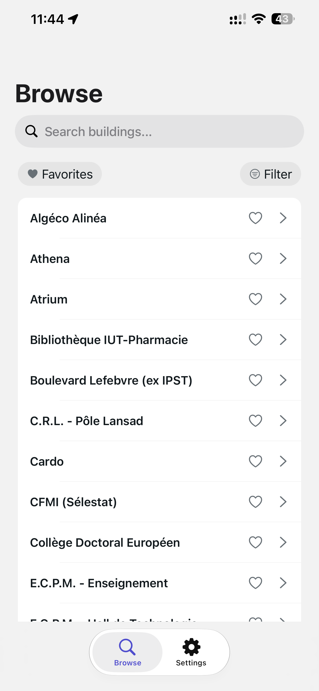
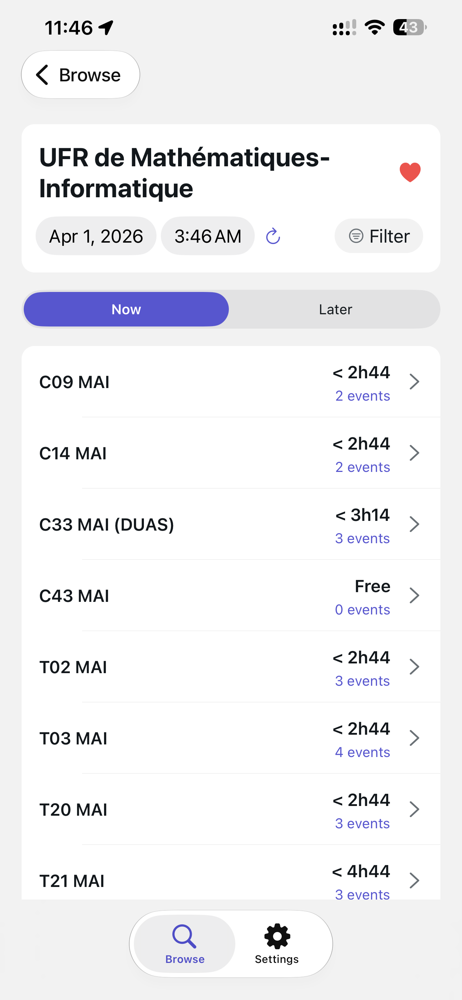
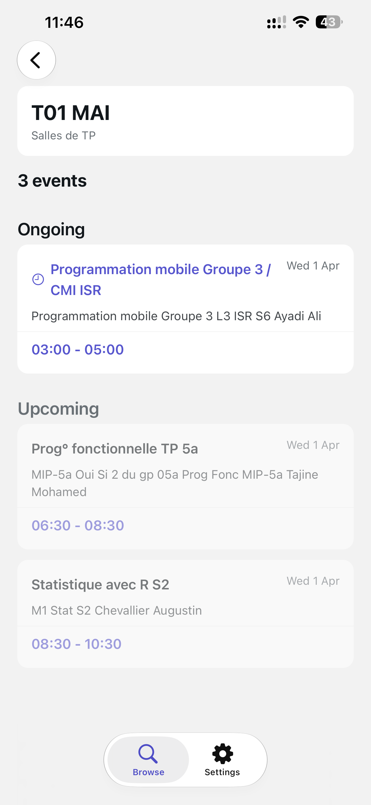
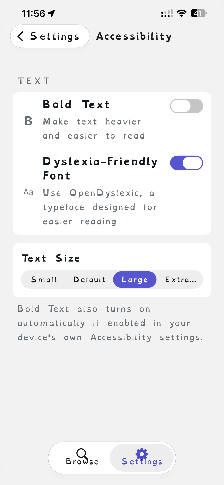
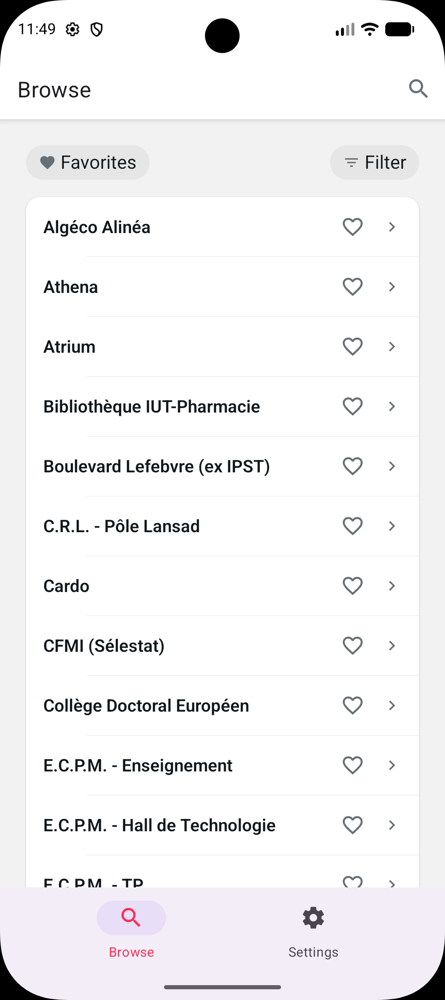
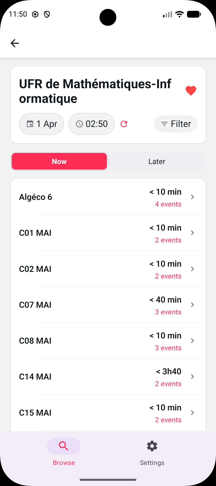
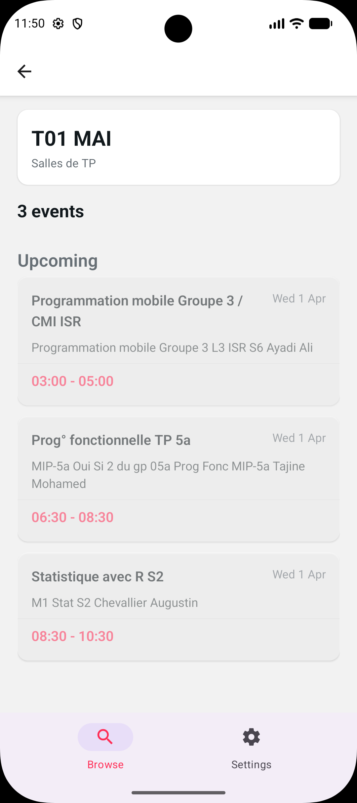
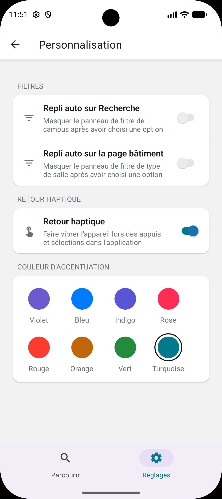

<div align="center">
  

# UniSquat

Find an empty room to study or work in at Université de Strasbourg — right now.

[](./LICENSE)


</div>

---

UniSquat reads Université de Strasbourg's own public [ADE](https://www.adecampus.com/) timetable feeds and tells you which rooms are free — now, or at any time/date you pick — across 74 buildings and 12 campuses. No account, no server, no tracking: everything runs on your device.

> UniSquat is an independent, community-made app. It is not affiliated with, endorsed by, or operated on behalf of Université de Strasbourg.

<table>
  <tr>
    <td align="center"><br/><sub>Browse — iOS</sub></td>
    <td align="center"><br/><sub>Room list — iOS</sub></td>
    <td align="center"><br/><sub>Room detail — iOS</sub></td>
    <td align="center"><br/><sub>Dyslexia-friendly font — iOS</sub></td>
  </tr>
  <tr>
    <td align="center"><br/><sub>Browse — Android</sub></td>
    <td align="center"><br/><sub>Room list — Android</sub></td>
    <td align="center"><br/><sub>Room detail — Android</sub></td>
    <td align="center"><br/><sub>Personalization — Android</sub></td>
  </tr>
</table>

## Features

**Room finder**

- Live "free now" and "free later" views for every room in a building, with a countdown to when that changes
- Pick any date/time to check availability in the future, not just right now
- Filter buildings by campus, search by name, and star your favorites

**Personalization**

- Switch between 8 accent colors, each independently tuned for contrast in both light and dark mode
- Toggle haptics, and whether filter panels auto-collapse after you pick an option

**Accessibility**

- Full VoiceOver / TalkBack support
- Bold Text and a 4-step Text Size setting
- An optional dyslexia-friendly typeface ([OpenDyslexic](https://opendyslexic.org/))
- Comfortable tap targets and legible color contrast throughout, in both light and dark mode

**Built for everyone**

- Fully localized into English, French, Spanish, Italian, German, Portuguese, Romanian, Arabic, and Chinese, matching your device's language automatically (with a manual override in Settings)
- No accounts, no analytics, no ads — see the Privacy Policy and Terms of Service screens in Settings for details

## Tech stack

- [Expo](https://expo.dev) + [Expo Router](https://docs.expo.dev/router/introduction/) (file-based navigation, native Stack + native tab bar)
- React Native with TypeScript
- [react-i18next](https://react.i18next.com) for internationalization
- `AsyncStorage` for local-only persistence (favorites, personalization settings) — nothing ever leaves the device
- Native platform components throughout: `DateTimePicker`, `SegmentedControl`, and `NativeTabs` (with iOS 26 Liquid Glass support)
- Runs on iOS 15.1+ (iPhone 6s and newer — 2015 hardware still welcome) or Android 7.0+ (API 24)

## Getting started

```bash
npm install
npx expo start
```

Scan the QR code with the [Expo Go](https://expo.dev/go) app on your device to run it.

## Contributing

Issues and pull requests are welcome — [open one on GitHub](https://github.com/lucianmocan/unisquat/issues/new). Since this is licensed under the GPL, anything you distribute based on this code needs to stay open source too (see below).

## Acknowledgements

Inspired by [unisquat.alwaysdata.net](https://unisquat.alwaysdata.net/), the original UniSquat.

## License

This project is licensed under the GNU General Public License v3.0 — see [LICENSE](./LICENSE) for the full text.
